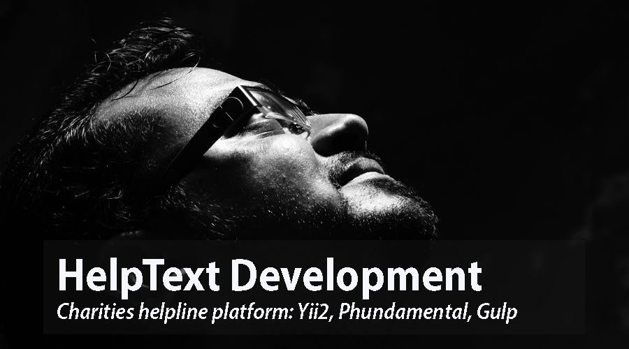

#Project Based in Yii2 and Phundament4 with Gulp as assets generation tool

helptext
This project is intended as a live, working pilot for a platform to empower existing non-profit helplines by providing access and management of mobile text and other emerging ways of communication. The platform will allow integration with their existing systems as well as upgrade, to enable them to keep-up and transfer their standards, knowledge and skills with ease.


## Some features
- Simplify configuration file by [Phundamental 4](https://github.com/phundament/app)
- Dashboard theme based in [AdminLTE 2](http://almsaeedstudio.com/AdminLTE) for backend with extra plugins for chars.
- User Managment with RDAC to use roles and permisions.
- Migrations support with [yii2-migration-utility by Jon Chambers] (https://github.com/c006/yii2-migration-utility)
- Gulp configuration based in [Jacob Moen zurbified] (https://github.com/jacmoe/yii2-app-basic-zurbified) but with out foundation :)
- Multi Phone Calls and SMS providers integration (ie. Twilio)


# Installation
## Prerequisites
Before you start, make sure you have installed [composer](https://getcomposer.org/) and [Node.js](http://nodejs.org/).
If you are on Debian or Ubuntu you might also want to install the [libnotify-bin](https://packages.debian.org/jessie/libnotify-bin) package, which is used by Gulp to inform you about its status.

### Duplicate the .env-dist file
add a key http://randomkeygen.com/


### Gulp
install gulp globally if you haven't done so before

```
npm install -g gulp-cli
```
### Browsersync
install browsersync globally if you haven't done so before

```
npm install -g browser-sync
```
## Composer
```
composer global require "fxp/composer-asset-plugin:~1.1.1"
composer update
```

## Post-installation

initialize the application, choose "development"
```
./init
```

### Post-installation
Install the node modules by running this command at the project root directory:
```
npm install
```
After a successful install, build the project using:
```
gulp build
```

To launch a browser window and watch the project for changes:
~~~
gulp
~~~

To build optimized for production (minification, etc) specify the `production` flag:

~~~
gulp build --production
~~~
and/or
~~~
gulp --production
~~~


### dev environment notes:
```
etc/apache2/sites-available configuration
<VirtualHost *:80>
    ServerName helptext.dev
    DocumentRoot "/var/www/helptext/htdocs/web"
    ServerAlias www.helptext.dev
    <Directory /var/www/helptext/htdocs/web>
            Options +FollowSymlinks
            AllowOverride All
            Order allow,deny
            allow from all
    </Directory>
    ErrorLog ${APACHE_LOG_DIR}/helptext.log
</VirtualHost>
```

## you will have this
ln -s ../local/.env .env


## you will need to configure the sms provider in your .env


## configure the sms provider http post request url
http://www.yourdomain.com/en/message/call
http://www.yourdomain.com/en/message/sms


you will need swiftmailer in order to work the email
```
sudo apt-get update
sudo apt-get install libphp-swiftmailer
```

###In Production with a shared hosting
- Probably you want have the chance to create your own apache configuration file but you can add this to the .htaccess field in the web folder

```
#  Add directives
RewriteEngine on

#  Change root directory to "web" folder
RewriteCond %{THE_REQUEST} ^GET\ /web/
RewriteRule ^web/(.*) /$1 [L,R=301]
RewriteRule !^web/ web%{REQUEST_URI} [L]
```

In the web folder then

```

allow from all

IndexIgnore */*

RewriteEngine On

RewriteCond %{REQUEST_FILENAME} !-f
RewriteCond %{REQUEST_FILENAME} !-d

RewriteRule . index.php

```

- If the hosting has a proper security some php functions like exec will be ban.
You don't need them to yii2 run or even create the assets folder, but you want be able to complie less on the go thats why we replace the less compilation and we run gulp before we go to staging or production.

###Troubleshooting on deploying

##env PROD
#First of all if there are errors then change .env to dev and set debug mode to see errors

#Error "An internal server error occurred."
- the app is running check db credentials in .env

#Error "The file or directory to be published does not exist: /home/oechitchat/BDP2F17M/htdocs/src/../vendor/bower/jquery/dist"
- change the name of folder bower-asset to bower in the vendor folder

#Error seeing images
- have you run gulp localy?
- delete the assets in production to force to regenerate

###Some other documentation
- [Create new migrations](docs/migrations.md)
